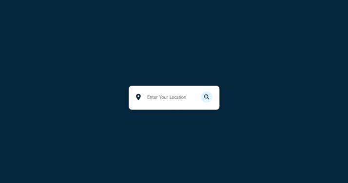

# WEATHER APP

### Description

This is a weather app built using JavaScript and animated SVGs. It follows the BEM methodology and applies semantic HTML. The app utilizes the OpenWeather API to fetch weather data.

### Warning !

You need to obtain your own API key by registering at [OpenWeather API](https://openweathermap.org/api)

```javascript
const APIKey = 'Your API Key!'
```

### Preview

Here we have project preview :



and a screenshot :


## Credits and Sources

- [OpenWeather API](https://openweathermap.org/api)
- Iconos de [Fontawesome](https://fontawesome.com/icons)
- SVGs de [Meteocons](https://basmilius.github.io/weather-icons/index-fill.html)
